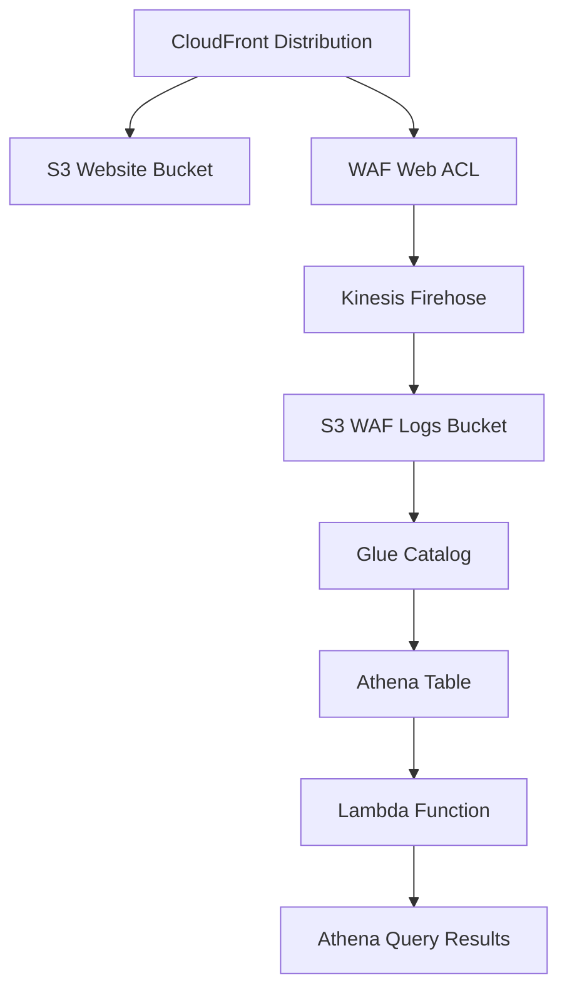

# AWS WAF Logs Analysis Infrastructure

このプロジェクトは、AWS WAF ログの分析と可視化のためのインフラストラクチャを提供します。CloudFront + S3 によるウェブサイトホスティングと、WAF ログの Athena 分析機能を組み合わせた包括的なソリューションです。

## 🏗️ アーキテクチャ



## 🚀 主な機能

### 1. ウェブサイトホスティング

- **CloudFront + S3**: 高速なコンテンツ配信
- **HTTPS 自動リダイレクト**: セキュアな通信
- **Origin Access Control (OAC)**: S3 バケットのセキュリティ強化

### 2. WAF セキュリティ

- **AWS WAF v2**: 包括的なセキュリティ保護
- **マネージドルールセット**: 一般的な攻撃パターンの自動検出
- **ログ記録**: すべてのリクエストの詳細ログ

### 3. ログ分析システム

- **Kinesis Firehose**: リアルタイムログ配信
- **S3 パーティション**: 効率的なログ保存（年/月/日/時間別）
- **Glue Catalog**: メタデータ管理
- **Athena**: SQL クエリによるログ分析

### 4. Lambda 関数

- **Athena Query Function**: カスタムクエリ実行
- **MCP Server**: Model Context Protocol 対応

## 📊 WAF ログテーブル構成

### テーブル情報

- **テーブル名**: `waf_logs`
- **データベース名**: `waf_logs_database`
- **データ形式**: JSON
- **パーティション**: 年/月/日/時間別

### 主要カラム

| カラム名            | データ型 | 説明                                         |
| ------------------- | -------- | -------------------------------------------- |
| `timestamp`         | `bigint` | リクエストのタイムスタンプ（ミリ秒）         |
| `action`            | `string` | 実行されたアクション（ALLOW/BLOCK/COUNT 等） |
| `httprequest`       | `struct` | HTTP リクエスト情報（IP、URI、メソッド等）   |
| `terminatingruleid` | `string` | 終了ルールの ID                              |
| `webaclid`          | `string` | WAF Web ACL の ID                            |

### パーティションキー

- `year`: 年（YYYY 形式）
- `month`: 月（MM 形式、2 桁）
- `day`: 日（DD 形式、2 桁）
- `hour`: 時間（HH 形式、2 桁）

## 🛠️ セットアップ

### 前提条件

- Node.js 18 以上
- AWS CLI 設定済み
- AWS CDK v2

### インストール

```bash
# 依存関係のインストール
npm install

# TypeScriptのコンパイル
npm run build
```

### デプロイ

```bash
# CDKブートストラップ（初回のみ）
npx cdk bootstrap

# スタックのデプロイ
npx cdk deploy
```

## 📝 使用例

### 基本的な WAF ログ分析クエリ

```sql
SELECT
  from_unixtime(timestamp/1000) as request_time,
  httprequest.clientip as client_ip,
  httprequest.country as country,
  httprequest.httpmethod as method,
  httprequest.uri as uri,
  action,
  terminatingruleid
FROM waf_logs_database.waf_logs
WHERE year='2025' AND month='01'
LIMIT 100;
```

## 🔧 開発コマンド

```bash
# TypeScriptのコンパイル
npm run build

# ファイル変更の監視
npm run watch

# テストの実行
npm run test

# CDKコマンド
npx cdk synth    # CloudFormationテンプレートの生成
npx cdk diff     # デプロイ前の差分確認
npx cdk deploy   # スタックのデプロイ
npx cdk destroy  # スタックの削除
```

## 📁 プロジェクト構造

```
infra/
├── bin/
│   └── infra.ts              # CDKアプリケーションエントリーポイント
├── lib/
│   └── infra-stack.ts        # メインのCDKスタック定義
├── lambda/
│   └── athena-query.ts       # Athenaクエリ実行Lambda関数
├── website/
│   ├── index.html            # メインウェブサイト
│   └── error.html            # エラーページ
├── test/
│   └── infra.test.ts         # テストファイル
├── package.json              # 依存関係定義
├── cdk.json                  # CDK設定
└── tsconfig.json             # TypeScript設定
```

## 🔍 出力値

デプロイ後、以下の情報が出力されます：

- **WebsiteBucketName**: ウェブサイトホスティング用 S3 バケット名
- **DistributionDomainName**: CloudFront ディストリビューションのドメイン名
- **DistributionUrl**: CloudFront ディストリビューションの URL
- **WebACLArn**: WAF Web ACL の ARN
- **AthenaResultsBucketName**: Athena クエリ結果用 S3 バケット名
- **GlueDatabaseName**: Glue データベース名
- **AthenaWorkgroupName**: Athena ワークグループ名
- **AthenaQueryFunctionArn**: Athena クエリ Lambda 関数の ARN
- **SampleAthenaQuery**: サンプルクエリ

## 🔒 セキュリティ

- **S3 バケット**: すべてプライベート設定
- **CloudFront**: Origin Access Control (OAC)使用
- **WAF**: マネージドルールセットによる保護
- **IAM**: 最小権限の原則に従った権限設定

## 📈 監視とログ

- **WAF ログ**: すべてのリクエストが S3 に保存
- **CloudWatch**: WAF メトリクスの自動収集
- **Athena**: SQL クエリによる詳細分析

## 📄 ライセンス

このプロジェクトは MIT ライセンスの下で公開されています。
